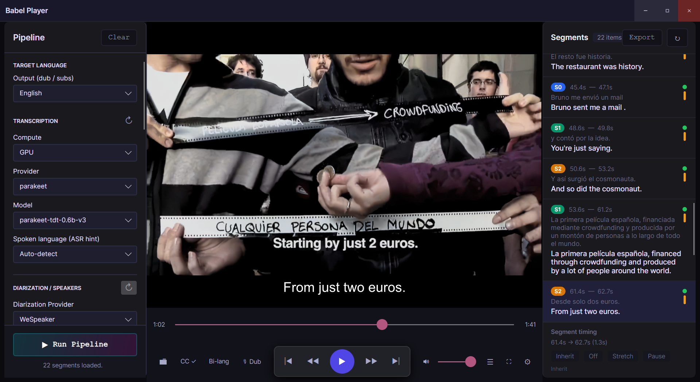

# Babel Player

[](https://github.com/sponsors/mta-babel)
[](https://github.com/mta-babel/Babel-Player/actions/workflows/ci.yml)
[](https://github.com/mta-babel/Babel-Player/releases/latest)
[](#requirements)
[](https://dotnet.microsoft.com/)
[](LICENSE)

**Babel Player is a Windows desktop dubbing workstation built with .NET 10 and Avalonia 12. It takes local media through transcript, translation, per-segment TTS, preview, and export with explicit CPU, GPU, and cloud routing.**

```text
Load Media -> Timed Transcript -> Optional Diarization -> Translation -> Dubbed Audio -> Preview -> Export
```



Babel Player is built and maintained by a solo developer.
If you find it useful, consider sponsoring:

[](https://ko-fi.com/babel_player)

## What It Does

Babel Player is not a subtitle editor with AI bolted on. The core workflow is:

1. Load a local video or audio file.
2. Transcribe it into timed segments.
3. Optionally diarize speakers.
4. Translate the segments into a target language.
5. Generate dubbed speech per segment.
6. Preview source and dub in context.
7. Re-run only the stage or segments you want to refine.
8. Export captions, dubbed audio, or a muxed MP4.
9. Reopen the session later without recomputing everything.

## What Works Today

- Explicit `CPU`, `GPU`, and `Cloud` compute profiles per inference stage.
- Managed local GPU host is the default GPU path. Docker remains an advanced optional backend, not the primary runtime.
- Local transcription, translation, and TTS paths alongside optional cloud providers.
- Optional multi-speaker diarization with per-speaker voice assignment through the Speaker Reference Wizard.
- Streaming overlap for transcription, translation, and per-segment TTS when the selected providers and runtime path allow it.
- Runtime-switchable app UI language with `Auto (system)` support.
- Embedded playback with libmpv, source/dub switching, subtitles, and segment-aware preview.
- Export to `.srt`, dubbed `.mp3`, and muxed `.mp4`.
- Session autosave and artifact reuse under `%LOCALAPPDATA%\BabelPlayer\`.

## Provider Support

### Transcription

| Provider | Compute | Notes |
|---|---|---|
| Faster Whisper | CPU | Local offline path |
| Faster Whisper | GPU | Managed local GPU host |
| Parakeet TDT 0.6B | GPU | Managed local GPU host |
| OpenAI Whisper API | Cloud | API key required |
| Google STT | Cloud | API key required |
| Google Gemini | Cloud | API key required |

### Translation

| Provider | Compute | Notes |
|---|---|---|
| CTranslate2 | CPU | Local lightweight path exposed in the UI |
| NLLB-200 | GPU | Managed local GPU host |
| DeepL API | Cloud | API key required |
| OpenAI API | Cloud | API key required |
| Google Gemini | Cloud | API key required |

### Text to Speech

| Provider | Compute | Notes |
|---|---|---|
| Piper | CPU | Fully offline local voices |
| Qwen3-TTS | GPU | Managed local GPU host, voice cloning path |
| Edge TTS | Cloud | No API key required |
| ElevenLabs API | Cloud | API key required |
| OpenAI TTS | Cloud | API key required |

### Diarization

| Provider | Compute | Notes |
|---|---|---|
| WeSpeaker | CPU | Managed CPU runtime |
| NeMo | GPU | Managed local GPU host |

## Language Support and Localization

- Persisted settings and pipeline artifacts use lowercase canonical language codes.
- Local dub targets are a curated set of 16 languages: `ar`, `de`, `en`, `es`, `fr`, `hi`, `it`, `ja`, `ko`, `nl`, `pl`, `pt`, `ru`, `sv`, `tr`, `zh`.
- The app UI also ships localized resources for those same 16 language codes, plus an `Auto (system)` app-language mode in Settings.
- `Auto (system)` resolves the OS locale at launch and falls back to English when the OS language is not in the shipped UI-language catalog.
- Arabic UI uses right-to-left flow direction.
- Piper currently covers 14 of those 16 dub targets in the in-app catalog. For `ja` and `ko`, use Edge TTS, Qwen3-TTS, or a cloud provider.
- Transcription is broader than the curated dub list. Auto-detect remains the default.

## Playback and Preview

- Embedded playback uses `libmpv`.
- Export uses bundled `ffmpeg`.
- Source and dubbed audio can be previewed in context.
- RTX Video options are exposed in Settings when the hardware and playback path support them.
- `RTX HDR` and mpv HDR passthrough are mutually exclusive in the UI.

## Requirements

| Scenario | Requirement |
|---|---|
| OS | Windows 10 or 11 |
| Architectures | `x64` and `ARM64` |
| GPU features | NVIDIA CUDA-capable GPU for local GPU transcription, translation, Qwen TTS, and NeMo diarization |
| CPU-only path | Supported for Faster Whisper, CTranslate2, Piper, and WeSpeaker |

## Installation

### Releases

Download one of the Windows release artifacts from [GitHub Releases](https://github.com/mta-babel/Babel-Player/releases/latest):

- x64 installer: `Babel-Player-*-win-x64-setup.exe`
- x64 portable ZIP: `Babel-Player-*-win-x64-portable.zip`
- ARM64 portable ZIP: `Babel-Player-*-win-arm64-portable.zip`

The release bundle includes:

- `BabelPlayer.exe`
- the .NET runtime
- `libmpv-2.dll`
- `ffmpeg.exe`
- the Python host assets under `inference/`
- bundled Windows tools such as `uv.exe`

For a shorter install guide, see [docs/install-windows-release.md](docs/install-windows-release.md).

## First Run

Babel Player manages its Python environments automatically. No separate Python install is required.

On first use, the app may download runtimes, models, or voices into `%LOCALAPPDATA%\BabelPlayer\runtime\` depending on the providers you select.

Typical workflow:

1. Open a local media file.
2. Pick `CPU`, `GPU`, or `Cloud` for each stage.
3. Choose a provider and model or voice.
4. Add API keys in Settings if you are using cloud providers.
5. Run the pipeline.
6. Review or regenerate specific segments.
7. Export `.srt`, `.mp3`, or `.mp4`.

## Source Build

### Prerequisites

- .NET SDK 10
- Python available for local verification helpers
- Windows, if you want to run the desktop app locally

### Build

```powershell
git clone https://github.com/mta-babel/Babel-Player.git
cd Babel-Player
pwsh ./scripts/fetch-win-native-deps.ps1
dotnet build Babel-Player.sln
dotnet run --project BabelPlayer.csproj -c Dev
```

Use `-SkipFfmpeg` only if you explicitly want just `libmpv` and `uv` without bundling `ffmpeg`/`ffprobe`.

`Dev` builds append `[DEV]` to the app title.

### Maintained Verification

```powershell
dotnet build Babel-Player.sln -c Release
dotnet test BabelPlayer.Tests/BabelPlayer.Tests.csproj -c Release
python scripts/check-architecture.py
python -m py_compile inference/main.py
```

The architecture linter (`scripts/check-architecture.py`) enforces structural rules and maintained-test hygiene: provider string constants, ViewModel pipeline call discipline, coordinator line limits, `PLACEHOLDER` requirements on unimplemented stubs, and the no-slow-tests policy described in [docs/testing-requirements.md](docs/testing-requirements.md).

### Regenerate UI translations

The English base `Resources/Strings.resx` is maintained by `scripts/build_strings_resx.py`. After adding or editing a key there, regenerate the 15 satellite `Resources/Strings.<lang>.resx` files with the DeepL-backed console tool:

```powershell
$env:DEEPL_API_KEY = "<your-deepl-key>"
dotnet run --project Tools/LocaleGenerator -c Release -- --languages de,fr,ja
```

Pass LocaleGenerator flags after `--` so `dotnet run` does not consume them first. For example:

```powershell
dotnet run --project Tools/LocaleGenerator -c Release -- --api-key "<your-deepl-key>" --languages ar,de,fr --source Resources/Strings.resx --out Resources
```

`--api-key <KEY>`, `--languages ar,de,...`, `--source`, and `--out` override the defaults. The tool skips any language that is not in DeepL's v2 catalog and prints it in the summary for manual review.

---

## License

Babel Player is licensed under the [GNU Affero General Public License v3.0](LICENSE) (AGPL-3.0).

Third-party libraries and pre-trained models are used under their respective licenses. See [THIRD_PARTY_LICENSES.md](THIRD_PARTY_LICENSES.md) for the full list.

### Non-commercial model restrictions

The **NLLB-200** translation model (Meta, CC-BY-NC-4.0) is licensed for **non-commercial use only**. If you intend to use Babel Player commercially, you must replace this model with a commercially-licensed alternative or obtain a separate license from Meta.

### Bundled binaries

Babel Player bundles **libmpv** (GPL-2.0-or-later) and **ffmpeg** (LGPL-2.1-or-later / GPL-2.0-or-later depending on build). Source code for these is available at their respective upstream repositories linked in [THIRD_PARTY_LICENSES.md](THIRD_PARTY_LICENSES.md).

---

## Dependencies

### Runtime (bundled in release)

```powershell
dotnet test BabelPlayer.Tests/BabelPlayer.Tests.csproj -c Release --filter "Category=Smoke"
```

Before adding or modifying tests, read [docs/testing-requirements.md](docs/testing-requirements.md).

The architecture linter (`scripts/check-architecture.py`) enforces structural rules and maintained-test hygiene, including provider string constants, ViewModel pipeline call discipline, coordinator line limits, `PLACEHOLDER` requirements on unimplemented stubs, and the no-slow-tests policy described in [docs/testing-requirements.md](docs/testing-requirements.md).

## Project Docs

Canonical repo docs:

- [AGENTS.md](AGENTS.md) — operating rules, learned preferences, and workspace facts
- [docs/AI-CONTEXT.md](docs/AI-CONTEXT.md) — repo structure, provider matrix, commands, and artifact locations
- [docs/architecture.md](docs/architecture.md) — structural boundaries and state ownership
- [docs/PLAN.md](docs/PLAN.md) — documentation map, current status, and retired-plan index
- [docs/Engineering-Plan.md](docs/Engineering-Plan.md) — current engineering status and active follow-up
- [docs/Next-Priorities-2026-04-16.md](docs/Next-Priorities-2026-04-16.md) — short active worklist
- [CONTRIBUTING.md](CONTRIBUTING.md) — contributor workflow

Historical milestone evidence lives under [docs/history/](docs/history/).

## Current Status

The current repo truth is:

- the end-to-end dubbing workflow is implemented
- streaming transcription-to-translation-to-TTS orchestration exists
- the managed local GPU host is the default GPU backend
- Docker is still supported as an advanced same-contract backend
- active follow-up is mostly hardening, progress UX, and further coordinator/runtime cleanup rather than missing core pipeline stages

See [docs/Engineering-Plan.md](docs/Engineering-Plan.md) for the maintained engineering status.

## Contributing

Start with:

- [AGENTS.md](AGENTS.md)
- [docs/AI-CONTEXT.md](docs/AI-CONTEXT.md)
- [docs/PLAN.md](docs/PLAN.md)
- [docs/architecture.md](docs/architecture.md)
- [docs/testing-requirements.md](docs/testing-requirements.md)

Contributions should protect the real user path:

```text
load media -> transcript -> translated dialogue -> spoken output -> preview/refine -> resume later
```

## License

Babel Player is licensed under the [GNU Affero General Public License v3.0](LICENSE) (AGPL-3.0).

Third-party libraries and model licenses vary. See [THIRD_PARTY_LICENSES.md](THIRD_PARTY_LICENSES.md).

The public docs site is served at [babelworks.github.io/Babel-Player](https://babelworks.github.io/Babel-Player/).
