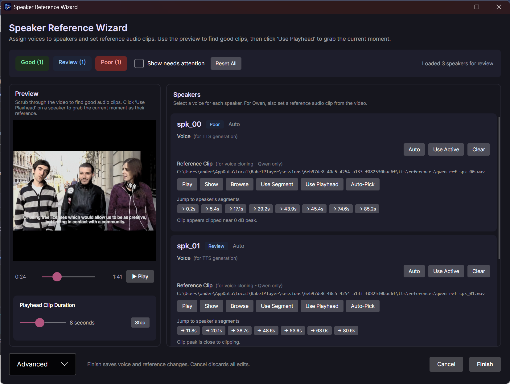

# Babel Player

[](https://github.com/sponsors/mta-babel)
[](https://github.com/Babelworks/Babel-Player/actions/workflows/ci.yml)
[](https://github.com/Babelworks/Babel-Player/releases/latest)
[](#requirements)
[](https://dotnet.microsoft.com/)
[](LICENSE)


**Babel Player is a high-performance .NET 10 and Avalonia 12 workstation for segment-based AI video dubbing. Local RTX-accelerated transcription, translation, and voice cloning with cloud API support. Built natively for Windows x64 and ARM.**

```
The Pipeline: Load Media → Timed Transcript → Voice Assignment → Translated Dialogue → Voiced Dubbing → In-Context Preview
```


Babel Player is built and maintained by a solo developer.
If you find it useful, consider sponsoring:

[](https://ko-fi.com/babel_player)


---

## Table of Contents

- [What It Does](#what-it-does)
- [Features](#features)
- [Interface screenshots](#interface-screenshots)
- [Provider Support](#provider-support)
- [Language support](#language-support)
- [Requirements](#requirements)
- [Installation](#installation)
- [First Run](#first-run)
- [Source Build](#source-build)
- [License](#license)
- [Dependencies](#dependencies)
- [Current Limitations](#current-limitations)
- [Roadmap](#roadmap)
- [Project Layout](#project-layout)
- [Contributing](#contributing)

---

## What It Does

Babel Player is a dubbing workstation, not a subtitle editor or a translation tool in isolation. The goal is to get a piece of foreign-language source media to a point where you can hear the translated dialogue spoken back, then refine it until it sounds right.


The full loop:

1. **Load** a local video or audio file
2. **Transcribe** — generate a timed transcript using local AI or a cloud API
3. **Diarize & Assign**: Identify unique speakers and assign specific voices to individual segments.
4. **Translate** — adapt the transcript into a target language
5. **Dub** — generate a spoken TTS audio track, one segment at a time
6. **Preview** — play source video alongside dubbed segments; toggle between original and dub audio
7. **Refine** — regenerate individual segments, adjust text, re-run TTS on demand
8. **Export** — save captions as `.srt`
9. **Persist** — sessions save automatically; reopen and continue later

---

## Features

### Pipeline

- Segment-based workflow: each transcript line is an independent unit that can be individually translated, re-dubbed, or replaced
- Full pipeline runs in order: transcription → translation → TTS generation
- Individual segments can be regenerated at any stage without re-running everything
- Stage gating: downstream stages only enable when upstream results are present and artifacts are on disk
- Word-level timestamps from transcription enable fine-grained segment editing

### Interface screenshots

<table>
  <tr>
    <td></td>
    <td></td>
  </tr>
  <tr>
    <td><em>Source media through transcription, optional vocal separation, and diarization — each stage shows explicit CPU / GPU / Cloud routing and readiness.</em></td>
    <td><em>Translation, per-segment text-to-speech, and caption export — downstream stages stay gated until upstream artifacts exist.</em></td>
  </tr>
</table>



*Multi-speaker flow: record or choose reference audio so diarization, voice assignment, and cloning stay consistent per speaker.*

### Compute Selection

Each inference stage exposes a CPU / GPU / Cloud selector with no hidden routing. If the selected compute path is unavailable, the stage blocks with a clear remediation message. There is no silent fallback.

- **CPU** — local Python subprocess; works on any Windows machine; no GPU required
- **GPU** — routes through a managed local Python venv host (default); NVIDIA GPU with CUDA required. 
- **Cloud** — calls a remote API; requires the corresponding API key in Settings

The GPU path bootstraps a managed local venv automatically using the bundled `uv.exe`. No manual Python installation is required.

### Playback and Preview

- Embedded video playback powered by **libmpv** with GPU-accelerated rendering
- Source scrubbing and segment-aware navigation
- Toggle between source audio and dubbed segment audio in real time
- Subtitle overlay with bilingual display (source and translated text)
- Auto-hiding controls bar and fullscreen mode
- Hover-reveal volume slider
- Refined transport controls with unified pill styling and visual grouping

#### Embedded playback: RTX Video Super Resolution and HDR

On Windows, Settings exposes optional **RTX Video** features when **gpu-next** is enabled (mpv’s modern GPU video output path):

- **RTX Video Super Resolution (VSR)** upscales video via NVIDIA’s **d3d11vpp** path. It requires a **GeForce RTX-class GPU (Turing or newer)**, **NVIDIA driver 551.23 or newer**, RTX Video enabled in NVIDIA Control Panel, and gpu-next. The UI hides or disables VSR when this hardware gate is not met.
- **HDR** is mutually exclusive between **Off**, **NVIDIA driver RTX HDR** (driver-managed HDR; uses the **same RTX Video hardware floor** as VSR plus Windows HDR), and **mpv HDR passthrough** (tone-mapping and peak options inside mpv; **does not** use the RTX hardware gate—only an HDR-capable display with Windows HDR). If Windows HDR is off or the display is not HDR-capable, HDR modes are unavailable.

### Multi-Speaker Routing

- Automatic speaker diarization — **NeMo ClusteringDiarizer** (GPU / container path) or **WeSpeaker** (CPU)
- Per-speaker voice assignment — assign different TTS voices to different speakers
- Voice cloning for compatible providers (XTTS v2, Qwen3-TTS) — reference audio uploaded per speaker
- Speaker boundary detection — automatically splits segments at detected speaker changes
- Fallback voice configuration — intelligently routes unassigned speakers

### Session Management

- Sessions auto-save to `%LOCALAPPDATA%\BabelPlayer\state\`
- Recent sessions list with one-click restore
- Artifacts (transcripts, translations, TTS audio) are cached per-session under `%LOCALAPPDATA%\BabelPlayer\sessions\{SessionId}\`
- Artifact validation on restore — gracefully downgrades to last verified stage if files are missing
- Each inference stage exposes a CPU / GPU / Cloud selector with no hidden routing
- If the selected compute path is unavailable, the stage blocks with a clear remediation message

### Settings and Credentials

- Per-stage provider, model, and voice selection persisted across launches
- In-app API key manager with live validation
- Bootstrap diagnostics surface missing dependencies and configuration gaps at startup
- Hardware-aware compute type policy (selects `float16` / `int8` for older GPUs, `float8` for Blackwell)
- Container health status visible in Settings UI 

### Export

- SRT caption export — prefers translated text, falls back to source text
- Automatic speaker labels in exported captions (when diarization is enabled)

---

## Provider Support

### Transcription

| Provider | Runtime | Notes |
|---|---|---|
| [Faster-Whisper](https://github.com/SYSTRAN/faster-whisper) | GPU | Models: `tiny`, `base`, `small`, `medium`, `large-v3`; word-level timestamps |
| [Faster-Whisper](https://github.com/SYSTRAN/faster-whisper) | CPU | Same models as GPU; slower inference |
| [Google Gemini](https://ai.google.dev/) | Cloud | `gemini-2.0-flash`, `gemini-2.5-flash-preview-04-17`; requires API key |
| [Google Speech-to-Text](https://cloud.google.com/speech-to-text/docs) | Cloud | Requires API key |
| [OpenAI Whisper API](https://platform.openai.com/docs/guides/speech-to-text) | Cloud | Requires API key |

### Translation

| Provider | Runtime | Notes |
|---|---|---|
| [NLLB-200](https://huggingface.co/facebook/nllb-200-distilled-600M) | GPU | Models: `distilled-1.3B`, `1.3B`; the **family** covers 200+ languages, but the embedded UI pins **16** high-value targets (see [Language support](#language-support)) |
| [CTranslate2](https://github.com/OpenNMT/CTranslate2) | CPU | int8-quantized; model: `distilled-600M`; fast; same **16** UI targets as NLLB GPU path |
| [DeepL](https://www.deepl.com/docs-api) | Cloud | Higher quality for European languages; requires API key |
| [Google Gemini](https://ai.google.dev/) | Cloud | `gemini-2.0-flash`, `gemini-2.5-flash-preview-04-17`; requires API key |
| [OpenAI](https://platform.openai.com/docs/guides/text-generation) | Cloud | Requires API key |

### Text to Speech

| Provider | Runtime | Notes |
|---|---|---|
| [Qwen3-TTS](https://huggingface.co/Qwen/Qwen3-TTS) | GPU | Voice cloning; auto-extracts reference audio from source video |
| [Piper](https://github.com/rhasspy/piper) | CPU | Fully offline; fast; lower voice quality; curated voices align with **14** of the **16** local targets ([Language support](#language-support)) |
| [Edge TTS](https://github.com/rany2/edge-tts) | Cloud | **No API key required**; Microsoft Azure voices |
| [ElevenLabs](https://elevenlabs.io/docs) | Cloud | Highest voice quality; requires API key |
| [Google Cloud TTS](https://cloud.google.com/text-to-speech/docs) | Cloud | Requires API key |
| [OpenAI TTS](https://platform.openai.com/docs/guides/text-to-speech) | Cloud | Requires API key |

### Diarization (Speaker Detection)

| Provider | Runtime |
|---|---|
| [NeMo](https://github.com/NVIDIA/NeMo) | GPU |
| [WeSpeaker](https://github.com/wenet-e2e/wespeaker) | CPU |

---

## Language support

**At a glance:** **Dub targets** are a **curated set of 16** local output languages—each one is wired end-to-end (translation + UI catalogs + offline Piper voices where available) so the pipeline stays predictable and testable. **Transcription** is the flexible side: **Auto-detect** uses Whisper’s full breadth; the **optional spoken-language hints** are shortcuts for languages that match that same dub lineup, so what you hear and what you translate into stay in sync. Cloud translation APIs may add **extra destinations** beyond the embedded batch, depending on provider and integration.

Language coverage depends on **which stage** you mean. The UI distinguishes **what language you are dubbing into** (translation target) from **what language is spoken in the source** (transcription / ASR).

### Translate **to** (pipeline target / dub language)

The embedded **local** translation path (NLLB + CTranslate2) exposes **16** selectable **output** languages, aligned with the bundled tokenizer map:

Arabic (`ar`), German (`de`), English (`en`), Spanish (`es`), French (`fr`), Hindi (`hi`), Italian (`it`), Japanese (`ja`), Korean (`ko`), Dutch (`nl`), Polish (`pl`), Portuguese (`pt`), Russian (`ru`), Swedish (`sv`), Turkish (`tr`), Chinese — Simplified (`zh`).

The **NLLB-200** family can model additional pairs in research settings; Babel Player ships this **focused batch** so downloads, QA, and UX stay manageable. Cloud translation providers (DeepL, Gemini, OpenAI, …) can extend reach with **their** target lists when you route translation through them.

### Translate **from** (source speech / transcription)

**Transcription** uses **Faster-Whisper** (OpenAI Whisper weights). For **source** audio, the default is **Auto-detect**, which leverages Whisper across **many** spoken languages—use it whenever you want maximum coverage or the language does not appear in the hint list.

The **spoken-language hint** menu (Auto-detect, then 16 ISO codes) is not a cap on recognition: it is a **curated shortcut list**—languages that appear in **both** the local dub batch **and** Whisper’s ASR table—so choosing a hint lines up transcription with a **guaranteed local translation + dub path**. You are not trading away Whisper’s reach; you are optionally pinning a known-good pairing.

For **offline Piper TTS** (as of April 2026), the in-app voice catalog ships **14** of those **16** targets; **Japanese** and **Korean** use **Edge TTS**, **Qwen**, or another provider until Piper publishes matching voices—verify current voice lists in [rhasspy/piper-voices](https://github.com/rhasspy/piper-voices).

---
## Requirements

| Scenario | Requirements |
| :--- | :--- |
| **OS Architecture** | Windows 10 or 11 (**x64** and **ARM64** natively supported) |
| **GPU Acceleration** | NVIDIA GPU with CUDA support (RTX 30-series or newer recommended) |
| **VRAM** | 8GB+ for high-quality local cloning; 6GB minimum for base pipelines |

---
## First-run setup

Babel Player bundles `uv.exe` and manages all Python runtimes automatically — no manual Python installation required.

| Path | One-time download | Triggered by |
|------|-------------------|--------------|
| GPU inference | ~5 GB (torch+CUDA, faster-whisper, TTS models) | First GPU transcription/TTS use |
| CPU inference | ~800 MB (torch CPU, faster-whisper) | First CPU transcription use |
| Diarization | ~500 MB (NeMo or WeSpeaker) | First speaker detection use |

Downloads are cached in `%LOCALAPPDATA%\BabelPlayer\runtime\`. The CPU runtime bootstraps automatically in the background on first launch; progress is shown live in the status bar during install.

---

## Installation

### Portable

1. Download `Babel-Player-<version>-win-x64-portable.zip` from [GitHub Releases](https://github.com/Babelworks/Babel-Player/releases/latest).
2. Extract to a folder of your choice, e.g. `C:\Apps\BabelPlayer`.
3. Run `BabelPlayer.exe`.

The release bundle is self-contained and includes:

- `BabelPlayer.exe` and all .NET dependencies (runtime included — no separate .NET install required)
- `ffmpeg.exe`
- `libmpv-2.dll`
- `uv.exe` for managed Python venv bootstrapping
- Inference host assets under `inference/`

No registry entries are created. To uninstall: delete the folder and optionally clear `%LOCALAPPDATA%\BabelPlayer\`.

### Installer

An Inno Setup installer (`Babel-Player-<version>-win-x64-setup.exe`) is also available on the releases page. It installs to `%LOCALAPPDATA%\Programs\BabelPlayer` (no admin required), adds a Start Menu entry, and registers a clean uninstaller.

---

## First Run

1. Launch `BabelPlayer.exe`.
2. Click **Open** and load a local video or audio file.
3. In the pipeline pane, pick `CPU`, `GPU`, or `Cloud` for each stage.
4. Select a provider and model or voice for that stage.
5. If using cloud providers, go to **Settings → API Keys** and enter your credentials.
6. If using diarization (multi-speaker), enable it in the pipeline and pick a **NeMo** (GPU) or **WeSpeaker** (CPU) path per Settings.
7. Click **Run Pipeline**. The pipeline will:
   - Transcribe the source audio
   - Translate the transcript
   - Generate TTS audio for each segment
   - (If diarization enabled) detect speaker changes and assign voices per speaker
8. Review the timed segments in the right panel.
9. Use the playback controls to preview. Toggle **Dub mode** to hear the dubbed audio.
10. Regenerate individual segments as needed from the segment list.
11. Export captions with **Export** when done.

Sessions save automatically. Your session will appear in the recent sessions list next time you open the app.

---

## Source Build

1. **Clone the repository**
   ```bash
   git clone https://github.com/Babelworks/Babel-Player.git
   cd Babel-Player
   ```
2. **Fetch native binaries** (required for `libmpv-2.dll` and `uv.exe`). They are excluded from Git to keep the repository lean:
   ```powershell
   pwsh ./scripts/fetch-win-native-deps.ps1
   ```
3. **Build and run**
   ```powershell
   dotnet build Babel-Player.sln
   dotnet run --project BabelPlayer.csproj
   ```

Run the full verification suite:

```powershell
dotnet test
python scripts/check-architecture.py
python -m py_compile inference/main.py
```

The architecture linter (`scripts/check-architecture.py`) enforces structural rules: provider string constants, ViewModel pipeline call discipline, coordinator line limits, and `PLACEHOLDER` requirements on unimplemented stubs.

---

## License

Babel Player is licensed under the [GNU Affero General Public License v3.0](LICENSE) (AGPL-3.0).

Third-party libraries and pre-trained models are used under their respective licenses. See [THIRD_PARTY_LICENSES.md](THIRD_PARTY_LICENSES.md) for the full list.

### Non-commercial model restrictions

The **NLLB-200** translation model (Meta, CC-BY-NC-4.0) is licensed for **non-commercial use only**. If you intend to use Babel Player commercially, you must replace this model with a commercially-licensed alternative or obtain a separate license from Meta.

### Bundled binaries

Babel Player bundles **libmpv** (GPL-2.0-or-later) and **ffmpeg** (LGPL-2.1-or-later / GPL-2.0-or-later depending on build). Source code for these is available at their respective upstream repositories linked in [THIRD_PARTY_LICENSES.md](THIRD_PARTY_LICENSES.md).

---

## Dependencies

### Runtime (bundled in release)

| Dependency | Purpose |
|---|---|
| [**Avalonia 12.0.1**](https://avaloniaui.net/) | Desktop UI framework with Fluent theming |
| [**libmpv**](https://mpv.io/) | Native media playback (GPU-accelerated video rendering, NVDEC support) |
| [**ffmpeg**](https://ffmpeg.org/) | Media ingest, audio extraction, segment mixing, and format conversion |
| [**uv**](https://github.com/astral-sh/uv) | Python environment and package management |

### Python inference host (installed on first use via `uv`)

| Package | Purpose |
|---|---|
| `faster-whisper` | Local speech recognition with word-level timestamps |
| `ctranslate2` / `sentencepiece` | Local translation (CTranslate2 models) |
| `nllb-200` | NLLB-200 translation models (200+ languages) |
| `piper-tts` | Local neural TTS (CPU-based) |
| `qwen-tts` | Qwen3-TTS with voice cloning support |
| `tts` (Coqui) | XTTS v2 voice synthesis with cloning |
| WeSpeaker / related | CPU speaker embedding diarization (see `inference/requirements.txt`) |
| NeMo (GPU diarization) | Loaded where the NeMo diarization path is used (container / runtime image) |
| `torch` / `transformers` / `accelerate` | ML runtime with CUDA/CPU backends |
| `fastapi` / `uvicorn` | Inference HTTP server (containerized backend) |
| `soundfile` / `numpy` | Audio I/O and processing |


### Cloud APIs (optional, key required)

- [OpenAI](https://platform.openai.com/) — Whisper transcription, GPT translation, TTS
- [ElevenLabs](https://elevenlabs.io/) — High-quality TTS (no voice cloning yet; future work)
- [Google Cloud](https://cloud.google.com/) — Speech-to-Text, Cloud TTS
- [Google Gemini](https://ai.google.dev/) — Transcription and translation
- [DeepL](https://www.deepl.com/pro-api) — Translation

---

## Current Limitations

- **Windows only.** Linux and macOS are not supported. The architecture is designed for future portability but no cross-platform work has been done yet.
- **No video export.** SRT caption export works. The muxed video output (dubbed audio mixed into the source container) is planned for a future release.
- **GPU TTS validation in progress.** Qwen3-TTS are fully wired end-to-end; NVIDIA RTX path validated on real hardware. Blackwell (`float8`) dtype is wired but validation pending on real Blackwell hardware.
- **No real-time or streaming.** All stages process the full session; segment-level regeneration is available after the initial pass.

---

## Roadmap

### Planned (Milestone 13 and beyond)

- **Video export UI** — mux dubbed audio into the source container
- **Clean-machine validation** — full workflow without dev-environment assumptions
- **Improved crash/support logs** — artifacts usable by non-developers
- **Multi-file batch processing** — queue multiple media files in sequence
- **Additional TTS providers** — StyleTTS2, Kokoro, F5-TTS
- **Timeline editing** — adjust segment timing visually
- **Streaming support** — real-time preview for long-form content

### Under consideration

- macOS and Linux support
- Collaborative workflow integration

---

## Project Layout

```
Babel-Player/
├── Models/                  # Domain records and enums (session state, segments, providers, compute profiles)
├── Services/                # Workflow coordinator, providers, persistence, transport, host management
│   └── Registries/          # Per-stage provider registries with compute-aware filtering
├── ViewModels/              # MVVM layer with observables and commands
├── Views/                   # Avalonia XAML UI with refined styling
├── BabelPlayer.Tests/       # xUnit test project (large suite)
├── inference/               # Python inference server (FastAPI + Faster-Whisper + TTS + diarization)
├── scripts/                 # Architecture linter and development tooling
├── docs/
│   ├── architecture.md      # Structural map and ownership rules
│   ├── PLAN.md              # Milestone plans (index)
│   ├── context/             # Extra agent context (Gemini, Qwen, …)
│   └── history/
│       ├── smoke/           # Milestone smoke / gate evidence
│       └── benchmarks/    # Transcription benchmark runs + leaderboard
├── native/win-x64/          # libmpv-2.dll (fetched; see README setup)
├── installer/               # Inno Setup script
├── AGENTS.md                # Operating rules (read before non-trivial changes)
├── CLAUDE.md                # Claude / Cursor-oriented project context
├── CONTRIBUTING.md
├── README.md
├── LICENSE
└── BabelPlayer.csproj
```

Key files:

| File | Role |
|---|---|
| [Services/SessionWorkflowCoordinator.cs](Services/SessionWorkflowCoordinator.cs) | Single owner of all workflow and session state |
| [ViewModels/EmbeddedPlaybackViewModel.cs](ViewModels/EmbeddedPlaybackViewModel.cs) | Playback, preview, segment selection, dub mode, multi-speaker routing |
| [Models/ProviderNames.cs](Models/ProviderNames.cs) | All provider identifier constants |
| [Models/ComputeProfile.cs](Models/ComputeProfile.cs) | CPU / GPU / Cloud enum with hardware-aware selection |
| [Services/InferenceRuntimeCatalog.cs](Services/InferenceRuntimeCatalog.cs) | Compute profile → provider routing and normalization |
| [inference/main.py](inference/main.py) | Python inference server (transcription, translation, TTS, diarization) |
| [App.axaml.cs](App.axaml.cs) | Startup / composition root with diagnostics bootstrapping |

---

## Contributing

Read these first:

- [AGENTS.md](AGENTS.md) — operating rules and non-negotiables
- [CLAUDE.md](CLAUDE.md) — context and instructions for Claude
- [docs/context/GEMINI.md](docs/context/GEMINI.md) — context for Gemini-oriented assistants
- [docs/context/QWEN.md](docs/context/QWEN.md) — context for Qwen Coder–style setups
- [docs/PLAN.md](docs/PLAN.md) — milestone order and gates
- [CONTRIBUTING.md](CONTRIBUTING.md) — contributor workflow and scope discipline
- [docs/architecture.md](docs/architecture.md) — structural map and ownership rules
- [docs/typography.md](docs/typography.md) — typography tokens and semantic text classes (`Styles/Typography.axaml`)
- [docs/privacy-policy.md](docs/privacy-policy.md) — privacy policy (published copy also on GitHub Pages)
- [Marketing site (GitHub Pages)](https://babelworks.github.io/Babel-Player/) — Jekyll source on branch [`site`](https://github.com/Babelworks/Babel-Player/tree/site); push to that branch to deploy (workflow lives in `.github/workflows/` on `main`).

Minimum verification before opening a PR:

```powershell
dotnet build Babel-Player.sln
dotnet test Babel-Player.sln
python scripts/check-architecture.py
```

The project is in active milestone hardening. Contributions that preserve the working dubbing loop and keep readiness behavior truthful are welcome. Speculative features, silent fallbacks, and scope expansions outside the current milestone will be declined.
